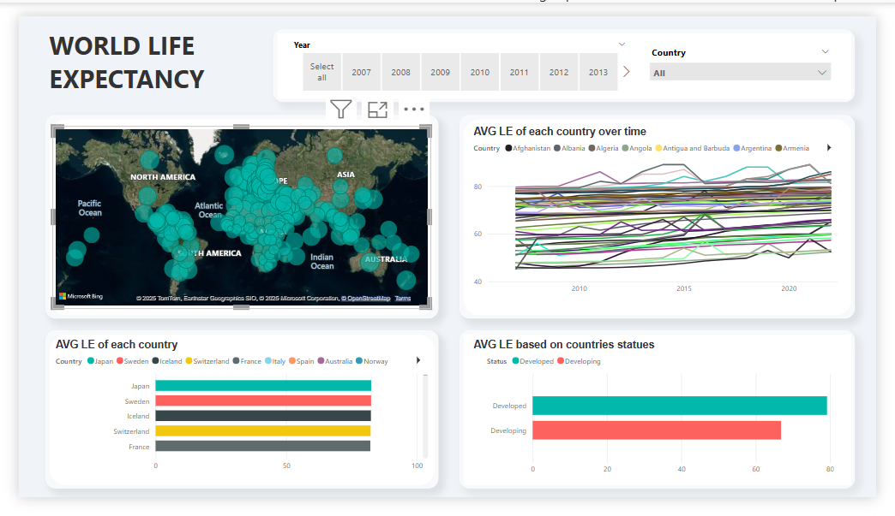
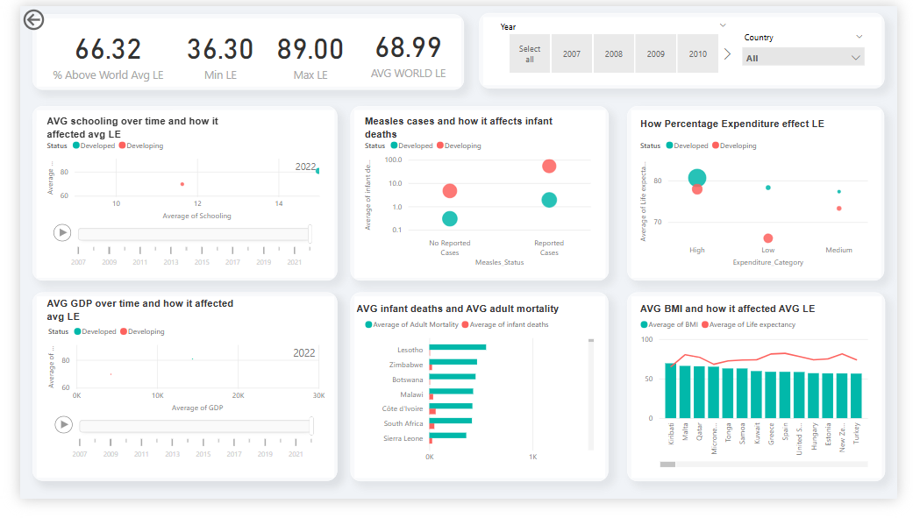

# 🌍 World Life Expectancy Analysis (2007 - 2022)

## 📌 Project Overview  
This project explores global life expectancy trends from **2007 to 2022** using **SQL (MySQL Workbench) for data cleaning and analysis**, followed by **Power BI for visualization**. The dataset contains various socio-economic and health-related indicators that influence life expectancy across different countries.  

## 🗂 Project Structure  
```
world_life_expectancy/
│── Dataset/
│   ├── Dirty_WorldLifeExpectancy.csv   # Raw dataset
│   ├── Clean_WorldLifeExpectancy.csv   # Cleaned dataset after preprocessing
│
│── Cleaning/
│   ├── cleaning.sql                    # SQL queries used for data cleaning
│
│── EDA/
│   ├── eda.sql                          # SQL queries used for exploratory data analysis (EDA)
│
│── Dashboard/
│   ├── world_life_expectancy.pbix       # Power BI dashboard file
│   ├── page1.png                        # Screenshot of Dashboard Page 1
│   ├── page2.png                        # Screenshot of Dashboard Page 2
│
│── README.md                            # Project documentation
```

---

## 🛠 Data Cleaning & Processing  
The dataset initially contained missing values, duplicates, and inconsistencies. The following steps were taken in **MySQL Workbench**:  
- **Missing Values Handling:**  
  - 7 missing values in `Status` were filled based on the same country’s corresponding values.  
  - 2 missing values in `Life Expectancy` were filled using the **average of surrounding values**.  
- **Duplicate Removal:** Ensured each row represents **one country and one year** uniquely.  
- **Additional Fixes in Power BI:**  
  - Corrected typos in country names.  
  - Added **new calculated columns** for better analysis.  

---

## 🔍 Exploratory Data Analysis (EDA)  
Key questions explored using SQL:  

1️⃣ **How has life expectancy changed over time for each country?**  
   - Tracked average life expectancy for each country across 15 years.  
   - Examined global trends in life expectancy over time.  

2️⃣ **How does economic growth (GDP) impact life expectancy?**  
   - Identified a positive correlation: Countries with **higher GDP tend to have longer lifespans**.  

3️⃣ **How does healthcare spending affect life expectancy?**  
   - Countries with **higher healthcare expenditure (%)** generally have higher life expectancy.  

4️⃣ **Do developed countries have better life expectancy?**  
   - **Developed nations** have **12.37 years higher** life expectancy on average than developing ones.  

5️⃣ **How does vaccination impact child mortality?**  
   - Countries reporting measles cases have **10x higher infant deaths** than those with no reported cases.  

6️⃣ **Does education influence life expectancy?**  
   - Countries with **higher schooling years** have **up to 16 years longer** life expectancy.  

7️⃣ **How does BMI affect life expectancy?**  
   - Countries with **low BMI and thinness issues** tend to have **below-average life expectancy**.  

8️⃣ **What is the relationship between adult mortality and life expectancy?**  
   - Countries with **higher adult mortality rates** have significantly **lower life expectancy**.  

---

## 📊 Power BI Dashboard  
The final analysis was visualized in **Power BI**, featuring:  
- **Interactive slicers** (Country & Year selection).  
- **Line charts, scatter plots, filled maps**, and **comparative bar charts**.  
- **Dynamic country-based insights**.  

**🔹 Dashboard Sneak Peek:**  
  
  

---

## 🚀 How to Use  
1️⃣ Clone the repository:  
   ```bash
   git clone https://github.com/Metwalley/world_life_expectancy.git
   ```  
2️⃣ Open **MySQL Workbench** and run `cleaning.sql` to clean the dataset.  
3️⃣ Run `eda.sql` to explore key insights.  
4️⃣ Load `world_life_expectancy.pbix` in **Power BI** for interactive visualizations.  

---

## 📌 Tools Used  
- **SQL (MySQL Workbench)** → Data Cleaning & Analysis  
- **Power BI** → Dashboard & Data Visualization  

---

## 🤝 Contributions  
Contributions are welcome! Feel free to submit a **pull request** or open an **issue** for any suggestions.  

---

## 📩 Contact  
📧 **Email:** [abdulrahmanfaragdatasci@gmail.com](mailto:abdulrahmanfaragdatasci@gmail.com)  
🔗 **GitHub:** [Metwalley](https://github.com/Metwalley) 
